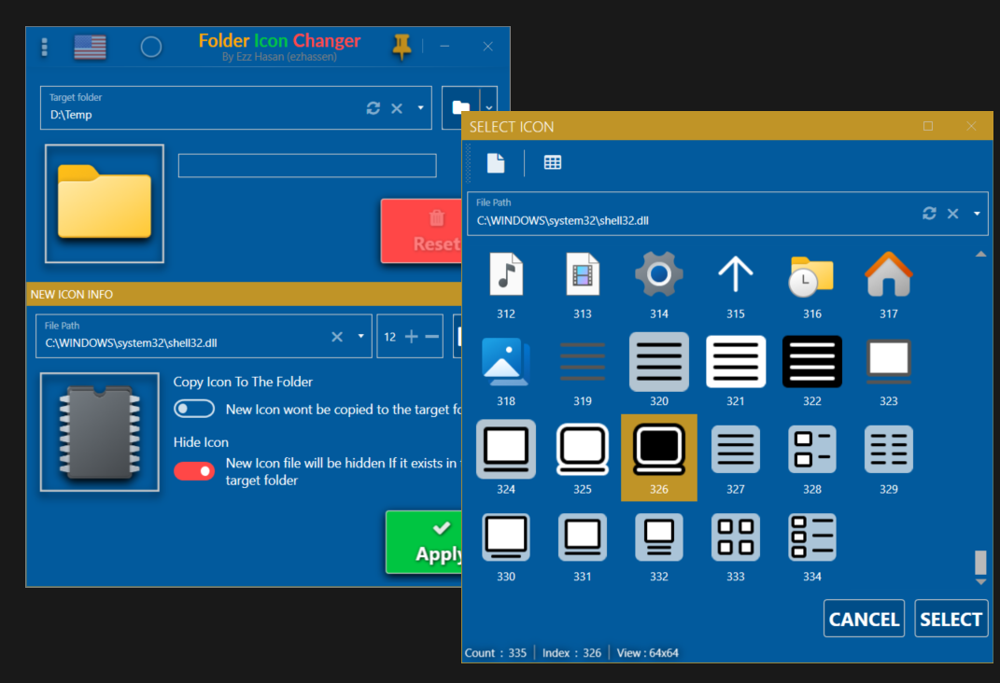
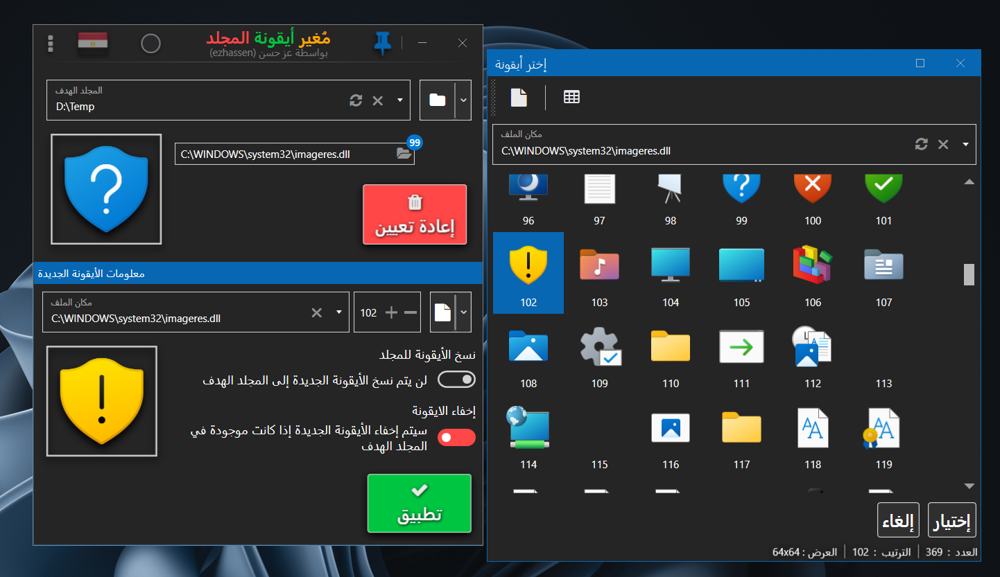

<p align="center">
  
</p>

<h1 align="center">Folder Icon Changer</h1>

<p align="center">
  <!--  -->
  
  
</p>

<p align="center">Easy-to-use & fast way to change folder icons in Windows.</p>

## Screenshots

<p align="center">
  
  
</p>

## Features

- Change any folder's icon in a few clicks
- Use icons from `.ico`, `.exe`, `.dll`, or image files with live preview
- Restore the default folder icon at any time
- Drag & drop folders and icon files directly onto the app
- Two built-in themes (Blue / Dark) and multilingual interface

## Installation

1. Download the latest installer from Releases:
   - `Folder Icon Changer Setup {version} x64.exe` — 64-bit Windows
   - `Folder Icon Changer Setup {version} x86.exe` — 32-bit Windows
2. If you use the framework-dependent build, install **.NET Desktop Runtime 10.0.x** first (see Requirements).
3. Run the installer.

## Usage

1. Launch **Folder Icon Changer**
2. Click **Browse** to select a folder
3. Click the icon preview / **Select Icon** to pick an `.ico` / `.exe` / `.dll`
4. Click **Apply** — the folder's `desktop.ini` is updated and the shell icon cache is refreshed
5. Use **Restore Default** to remove the custom icon

## Requirements

### For Users (running the installer / exe)

| Requirement | Details |
|---|---|
| **OS** | Windows 10 10240+ / Windows 11 (x64 or x86).
| **Runtime** | **.NET Desktop Runtime 10.0.x** (includes WPF). |
| **Disk** | ~30–50 MB + icons |


### For Developers (building from source)

| Requirement | Details |
|---|---|
| **.NET SDK** | **10.0.301+** (`global.json:3` with `rollForward: latestFeature`). `dotnet --version` must be `10.0.x`. |
| **IDE** | Visual Studio 2022 17.12+ or any editor with .NET 10 SDK (solution is `Folder Icon Changer.slnx` — new XML format, not `.sln`). |
| **Installer (optional)** | [Inno Setup 6](https://jrsoftware.org/isinfo.php) — `ISCC.exe` must be on `PATH`. Only needed if building installers (`--InstallerOnly` or default `./build.ps1`). |
| **OS** | Windows (WPF `net10.0-windows` + `UseWPF=true` cannot publish meaningfully on Linux/macOS). |

## Building from Source

```powershell
# 1. Verify SDK
dotnet --version  # must be 10.0.x (global.json pins 10.0.301)

# 2. Full publish + both installers (requires ISCC.exe on PATH)
./build.ps1
# Output: FolderIconChangerWPF/bin/Publish/win-x64|win-x86 + "Folder Icon Changer Setup/"

# Common variants (see build/Program.cs:261 BuildContext)
./build.ps1 --BuildOnly        # clean + publish, skip installers
./build.ps1 --InstallerOnly    # only ISCC.exe — requires prior publish (ISS reads version via GetVersionNumbersString('...Folder Icon Changer.exe'))
./build.ps1 --offline          # restore from C:\NugetPackageCache\
./buildOffline.ps1             # alias for --offline
./build.ps1 --SelfContained --Trimmed  # self-contained trimmed publish (no Desktop Runtime needed)

# Quick verification without Cake (no installer)
dotnet build "Folder Icon Changer.slnx" -c Release
dotnet build FolderIconChangerWPF/FolderIconChangerWPF.csproj -c Release -p:Platform=x64

# Clean
.\DeleteObjBinFolders.ps1 -Bin  # without -Bin only deletes obj/
```

Version is single-sourced in `FolderIconChangerWPF/FolderIconChangerWPF.csproj:20 <Version>4.2.3.0</Version>` (propagates to `AssemblyVersion`/`FileVersion`). ISS installers extract it at compile time via `#define MyAppVersion GetVersionNumbersString('...Folder Icon Changer.exe')` — so **publish before building installers**.

## Project Structure

```
Folder Icon Changer.slnx              # XML solution (VS 2022 17.12+ / .NET 10 SDK)
build/build.csproj                    # Cake Frosting orchestrator (Program.cs: UseWorkingDirectory(".."))
FolderIconChangerWPF/                 # Main app: net10.0-windows, UseWPF, AllowUnsafeBlocks, WinExe
  App.xaml → MainWindow.xaml          # Entry: StartupObject=FolderIconChangerWPF.App
  Pages/ + ViewModels/                # MVVM (MainPageViewModel, ApplicationViewModel, etc.)
  Windows/                            # SelectIconWindow, IconInfoImagesWindow
  Services/SettingsService.cs
  Helpers/ + Ezz_Helper/
  Controls/  Styles/  Themes/         # MahApps.Metro
  MultilingualResources/              # WPFLocalizeExtensionEzzFork
  Fonts/ Images/ Resources/icon.ico
FolderIconChanger_Installer_x64.iss   # SourceDir=.../bin/Publish/win-x64, OutputDir=Folder Icon Changer Setup
FolderIconChanger_Installer_x86.iss
Icon Designing/CFI.png                # High-res app icon (PNG), icon.ico is the Win32 icon
```

Key deps: `MahApps.Metro`, `WPFLocalizeExtensionEzzFork`, `Newtonsoft.Json`, `PortableJsonSettingsProvider`, `Microsoft.Windows.Compatibility`.

See `AGENTS.md` for agent-focused build quirks and exact command order.

## Acknowledgements

- Icon: `Icon Designing/CFI.png` / `FolderIconChangerWPF/Resources/icon.ico`
- UI: [MahApps.Metro](https://mahapps.com/), [WPFLocalizeExtension](https://github.com/XAMLBaker/WPFLocalizeExtension)
